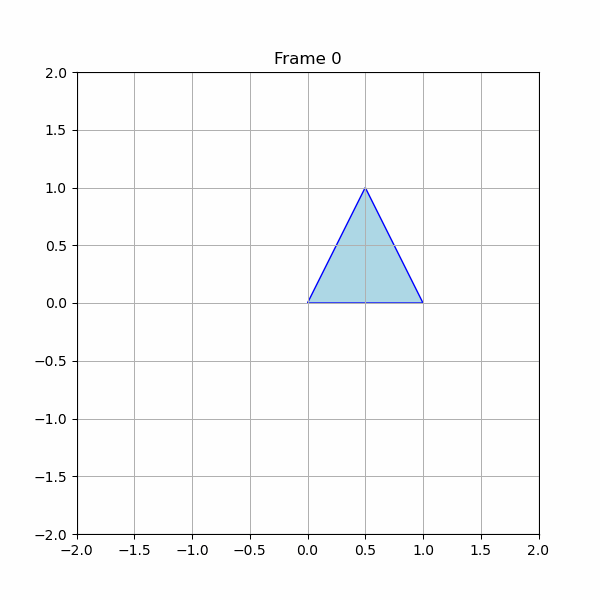

# 🧪 Taller 0 - Transformaciones Básicas en Computación Visual

## 📅 Fecha
`2025-04-15`

---

## 🎯 Objetivo del Taller

Explorar los conceptos fundamentales de **transformaciones geométricas** (traslación, rotación y escala) en distintos entornos de programación visual.  
Crear un **"Hola Mundo Visual"** donde se muestre un objeto o escena básica y se le apliquen **transformaciones estáticas y animadas en función del tiempo**.


---

## 🧠 Conceptos Aprendidos

- [X] Transformaciones geométricas (escala, rotación, traslación)

---

## 🔧 Herramientas y Entornos

- Python—Jupyter (`matplotlib`, `numpy`, `imageio`, `BytesIO`)
- Unity (versión LTS)
- Three.js (`React Three Fiber`)
- Processing

---

## 📁 Estructura del Proyecto

```
2025-04-15_taller0_transformaciones/
├── processing/            # Processing
├── python/                # Jupyter
├── threejs/               # Three.js
├── unity/                 # Unity
├── resultados/            # GIFs
├── README.md
```

---

## 🧪 Implementación

### 🔹 Etapas realizadas
1. **Configuración del entorno:** Instalación de dependencias y configuración de proyectos.
2. **Implementación de transformaciones geométricas:** Creación de un objeto básico (cubo, esfera, etc.) en cada entorno.
3. **Animación de transformaciones:** Aplicación de transformaciones estáticas (traslación, rotación, escala) y animaciones en función del tiempo (usando `frameCount`, `millis()`, `useFrame`, etc.).
4. **Exportación de resultados:** Exportación de animaciones como GIF.


### 🔹 Código relevante

#### Processing

```java
  // Aislar transformaciones con pushMatrix() y popMatrix()
  pushMatrix();
  
    // Trasladar al centro de la pantalla
    translate(width / 2, height / 2, 0);
    
    // Aplicar traslación ondulada
    translate(translationX, 0, 0);
    
    // Rotar sobre su eje Y
    rotateY(angle);
    angle += 0.02;
    
    // Escalar cíclicamente
    scale(scaleValue);
    
    // Dibujar el cubo
    box(100); // Tamaño base del cubo
  
  popMatrix();
```


#### Python

```python
# Segmentación semántica con DeepLab
output = model(input_tensor)['out']
prediction = output.argmax(1).squeeze().cpu().numpy()
```


#### Unity

```csharp
// 1. Traslación aleatoria cada ciertos segundos
timer += Time.deltaTime;
if (timer >= translationInterval)
{
    // Reiniciar el temporizador y obtener una nueva dirección aleatoria
    timer = 0f;
    randomDirection = GetRandomDirection();
}

// Aplicar traslación en la dirección aleatoria
transform.Translate(randomDirection * translationSpeed * Time.deltaTime);

// 2. Rotación constante
transform.Rotate(Vector3.up, rotationSpeed * Time.deltaTime);

// 3. Escalado oscilante usando Mathf.Sin
float oscillation = Mathf.Sin(Time.time) * scaleAmplitude;
transform.localScale = Vector3.one * (baseScale + oscillation);
```

#### Three.js

```javascript
// Función para aplicar animaciones con useFrame
useFrame(({ clock }) => {
    const time = clock.elapsedTime;

    // 1. Trasladar por una trayectoria senoidal
    mesh.current.position.x = Math.sin(time * 2) * 3; // X: seno
    mesh.current.position.y = Math.cos(time * 1.5) * 2; // Y: coseno

    // 2. Rotar sobre su eje (eje Y)
    mesh.current.rotation.y += 0.01; // Incremento constante

    // 3. Escalar con una función temporal (Math.sin)
    const scaleValue = 1 + 0.5 * Math.sin(time); // Escala entre 0.5 y 1.5
    mesh.current.scale.set(scaleValue, scaleValue, scaleValue);
});

```


---

## 📊 Resultados Visuales


### Processing


### Python


### Unity


### Three.js


---

## 🧩 Prompts Usados


### Processing
```text
Crear un sketch en Processing (2D o 3D) que dibuje una figura geométrica aplicando transformaciones dinámicas (traslación, rotación, escala) con pushMatrix() y popMatrix() en función del tiempo usando frameCount, millis() o sin().
```

### Python
```text
Crear una animación 2D en Python con matplotlib, numpy e imageio, aplicando traslación, rotación y escala mediante matrices de transformación en función del tiempo, y exportarla como GIF
```

### Unity
```text
Crear un proyecto 3D en Unity que agregue un cubo o esfera con un script en C# para aplicar traslación aleatoria, rotación constante y escalado oscilante usando transform.Translate(), transform.Rotate() y transform.localScale.
```

### Three.js
```text
Crear un proyecto con Vite y React Three Fiber que agregue un objeto 3D animado usando useFrame para trasladarlo en una trayectoria senoidal o circular, rotarlo sobre su eje y escalarlo con Math.sin(clock.elapsedTime).
```

---

## 💬 Reflexión Final

Aprendí a aplicar transformaciones geométricas básicas en diferentes entornos de programación visual, lo que me permitió entender mejor cómo funcionan estas transformaciones en la práctica.

La parte más interesante fue la implementación de las transformaciones en Unity, ya que me permitió ver cómo se aplican en un entorno de desarrollo de videojuegos y cómo afectan a la interacción del usuario con el objeto.

---


## ✅ Checklist de Entrega

- [x] Carpeta `2025-04-15_taller0_transformaciones`
- [x] Código limpio y funcional
- [x] GIF incluido con nombre descriptivo
- [x] README completo y claro
- [x] Commits descriptivos en inglés

---