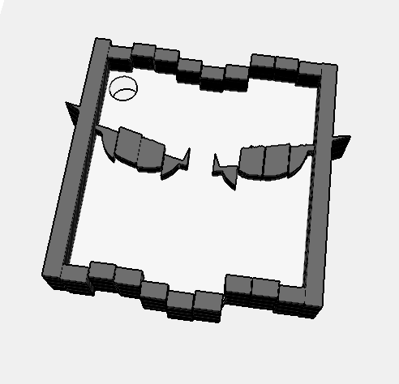

# 🧪 Taller #1 - Construyendo el Mundo 3D: Vértices, Aristas y Caras

## 📅 Fecha
`2025-04-23`

---

## 🎯 Objetivo del Taller

Comprender las estructuras gráficas básicas que forman los modelos 3D (mallas poligonales) y visualizar su estructura en distintas plataformas. Se explorará la diferencia entre vértice, arista y cara, así como el contenido de formatos de archivo estándar de malla como .OBJ, .STL y .GLTF.

---

## 🧠 Conceptos Aprendidos

- [x] Concepto y visualización de Estructuras graficas

---

## 🔧 Herramientas y Entornos


- Python/Jupyter (`vedo`, `trymesh`)
- Three.js (`typescript`, `@react-three/fiber`, `@react-three/drei`, `@three-stl-loader`)

---

## 📁 Estructura del Proyecto

```
2025-04-23_taller1_estructuras_3d/
├── python/                # Python
├── threejs/               # Three.js
├── datos/                 # Modelo STL
├── resultados/            # GIFs
├── README.md
```

---

## 🧪 Implementación


### 🔹 Etapas realizadas
1. Carga de modelo 3D en formato .STL
2. Extracción de vértices, aristas y caras
3. Visualización de la malla 3D
   - Vértices (puntos)
   - Aristas (líneas)
   - Caras (superficies)


### 🔹 Código relevante


#### Python

```python
mesh = trimesh.load('../datos/model.stl')
# Obtener las aristas como índices de vértices
edges_indices = mesh.edges_unique  # Formato: [ [v0, v1], [v2, v3], ... ]

# Convertir índices a coordenadas de vértices
edge_points = []
for idx in edges_indices:
    v0 = mesh.vertices[idx[0]]  # Coordenadas del primer vértice
    v1 = mesh.vertices[idx[1]]  # Coordenadas del segundo vértice
    edge_points.append([v0, v1])  # Almacenar como segmentos de línea
# Malla (caras)
vedo_mesh = vedo.Mesh([mesh.vertices, mesh.faces], c='black', alpha=0.5)

# Aristas (usando las coordenadas convertidas)
vedo_edges = vedo.Lines(edge_points, c='green5', lw=2)

# Vértices
vedo_vertices = vedo.Points(mesh.vertices, c='yellow', r=5)
```

#### Three.js

```react
const geometry = useLoader(STLLoader, '/model.stl');

useEffect(() => {
    if (geometry) {
        // Calculate vertex
        const vertexCount = geometry.attributes.position.count / 3;
        // Calculate face count
        const geoCount = geometry.index?.count as number;
        const faceCount =
            geoCount / 3 || geometry.attributes.position.count / 3;
        // Call the onModelLoaded function with vertex and face count
        onModelLoaded({ vertexCount, faceCount });
    }
}, [geometry, onModelLoaded]);

return (
    <>
        <mesh>
            // Set the position and rotation of the model
            <primitive object={geometry} />
            // Set the Material of the model
            <meshStandardMaterial color={new THREE.Color().setHex( 0x6c6969 )} />
            // Set the wireframe mode
            {mode === 'wireframe' && <Wireframe />}
        </mesh>
        // Set the edges of the model
        {mode === 'edges' && <Edges geometry={geometry} />}
    </>
);
```


---
## 📊 Resultados Visuales

### Modelo Base


### Python


### Three.js


---

## 🧩 Prompts Usados

### Python
```text
En un Jupyter Notebook, utiliza bibliotecas como trimesh, vedo, numpy y matplotlib para cargar y visualizar modelos 3D en formatos .OBJ, .STL o .GLTF. La malla debe mostrarse con colores diferenciados para vértices, aristas y caras, y se debe incluir una visualización que muestre información estructural del modelo, como la cantidad de vértices, aristas y caras. Como opción adicional, genera una animación que rote la malla para una mejor exploración visual.
```


### Three.js
```text
Usando Vite y React Three Fiber, crea una aplicación que cargue un modelo 3D en formato .OBJ, .STL o .GLTF mediante @react-three/drei. El modelo debe visualizarse con OrbitControls para permitir la navegación interactiva. Implementa efectos visuales como Wireframe o Edges para resaltar vértices, aristas o caras del modelo. Como funcionalidad adicional, diseña una pequeña interfaz de usuario que permita alternar entre los modos de visualización (vértices, aristas, caras) y muestre información básica del modelo, como la cantidad de vértices y caras.
```


---

## 💬 Reflexión Final

Aprendí a trabajar con estructuras gráficas y a visualizar modelos 3D de manera efectiva. La diferencia entre vértices, aristas y caras se volvió más clara al implementarlo en Python y Three.js.

La parte más interesante fue la visualización de los modelos 3D y cómo se pueden manipular en tiempo real con Three.js. Sin embargo, la parte más compleja fue el desarrollo en Python, ya que la biblioteca `vedo` ha tenido algunos cambios y no estaba completamente documentada.

---


## ✅ Checklist de Entrega

- [x] Carpeta `2025-04-23_taller1_estructuras_3d`
- [x] Código limpio y funcional
- [x] GIF incluido con nombre descriptivo
- [x] README completo y claro
- [x] Commits descriptivos en inglés

---