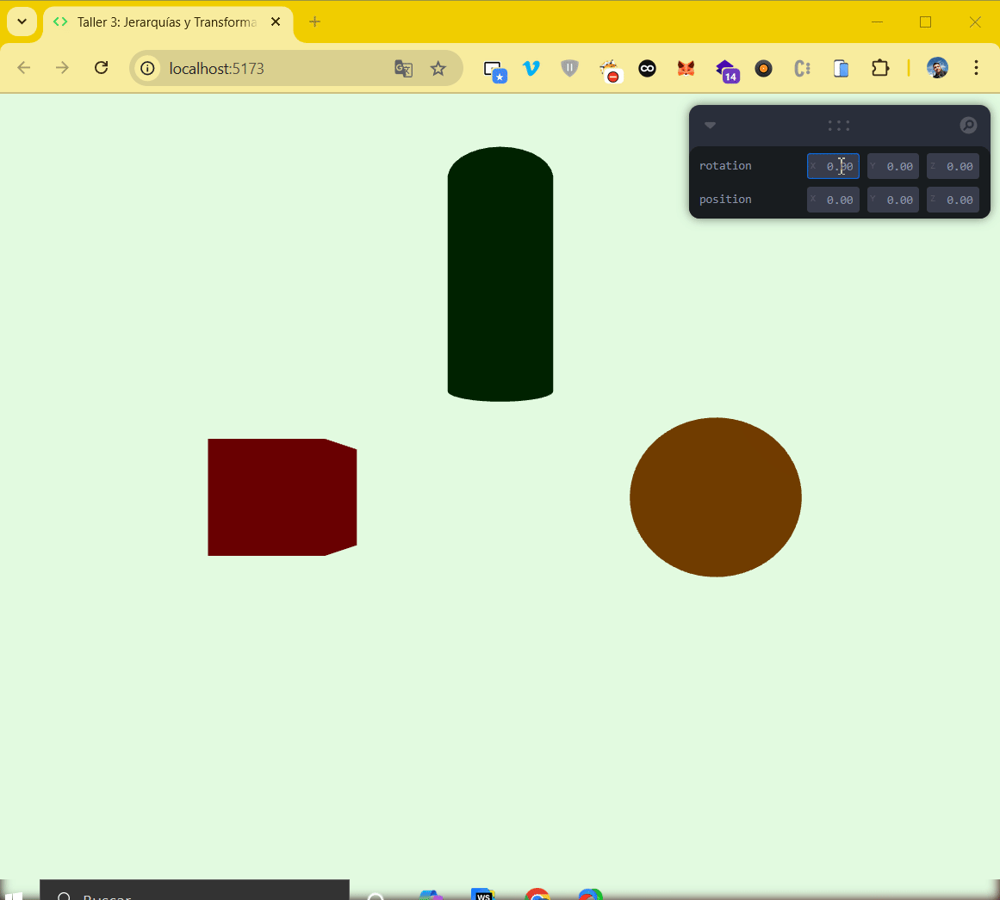

# 🧪 Taller #2 - Jerarquías y Transformaciones: El Árbol del Movimiento

## 📅 Fecha
`2025-04-23`

---

## 🎯 Objetivo del Taller

Aplicar estructuras jerárquicas y árboles de transformación para organizar escenas y simular movimiento relativo entre objetos. Se busca comprender cómo las transformaciones afectan a los nodos hijos en una estructura padre-hijo y cómo visualizar estos efectos en tiempo real.

---

## 🧠 Conceptos Aprendidos

- [x] Estructuras jerárquicas.
- [x] Arboles de transformación.

---

## 🔧 Herramientas y Entornos

- Unity (versión LTS, XR Toolkit, Shader Graph)
- Three.js (`@react-three/fiber`, `@react-three/drei`, `leva`)

---

## 📁 Estructura del Proyecto

```
2025-04-23_taller2_jerarquias_transformaciones/
├── threejs/               # Three.js
├── unity/                 # Unity
├── resultados/            # capturas, métricas, gifs
├── README.md
```

---

## 🧪 Implementación


### 🔹 Etapas realizadas
1. Configuración del entorno de trabajo.
2. Creación de una escena básica con un grupo de objetos.
3. Implementación de transformaciones jerárquicas.
4. Integración de controles en tiempo real para manipular las transformaciones.


### 🔹 Código relevante


#### Unity

```csharp
// example
Code snippet
```

#### Three.js

```typescript jsx
// Configuración del grupo (rotación y posición)
const { rotation, position } = useControls({
    rotation: { value: [0, 0, 0], min: [-Math.PI, -Math.PI, -Math.PI], max: [Math.PI, Math.PI, Math.PI] },
    position: { value: [0, 0, 0], min: [-10, -10, -10], max: [10, 10, 10] },
});

// Grupo principal
return (
    <group rotation={rotation} position={position}>
        {/* Elementos hijos del grupo */}
        <mesh position={[-2, 0, 0]}>
            <boxGeometry args={[1, 1, 1]} />
            <meshStandardMaterial color="red" />
        </mesh>

        <mesh position={[2, 0, 0]}>
            <sphereGeometry args={[0.75, 32, 32]} />
            <meshStandardMaterial color="orange" />
        </mesh>

        <mesh position={[0, 2, 0]}>
            <cylinderGeometry args={[0.5, 0.5, 2, 32]} />
            <meshStandardMaterial color="green" />
        </mesh>
    </group>
);

```


---
## 📊 Resultados Visuales


### Unity


### Three.js


---

## 🧩 Prompts Usados


### Unity
```text
// Example
```

### Three.js
```text
Usando Vite y React Three Fiber, crea una escena 3D que incluya una estructura de objetos en grupo mediante <group>, con varios elementos <mesh> como hijos. Aplica transformaciones (rotación y traslación) al nodo padre y observa cómo se propagan a los nodos hijos. Además, integra una interfaz en tiempo real usando dat.GUI o Leva para controlar dinámicamente las transformaciones del grupo principal mediante deslizadores.
```


---

## 💬 Reflexión Final

- ¿Qué aprendiste o reforzaste con este taller?
- ¿Qué parte fue más compleja o interesante?
- ¿Qué mejorarías o qué aplicarías en futuros proyectos?

---

## ✅ Checklist de Entrega

- [x] Carpeta `2025-04-23_taller2_jerarquias_transformaciones`
- [ ] Código limpio y funcional
- [ ] GIF incluido con nombre descriptivo
- [ ] Visualizaciones o métricas exportadas
- [ ] README completo y claro
- [ ] Commits descriptivos en inglés

---