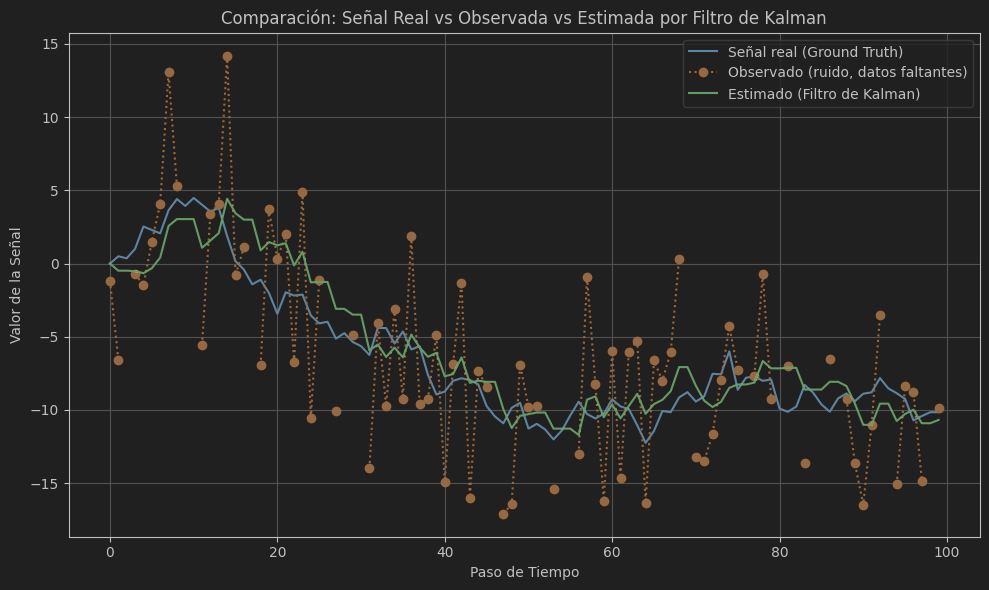
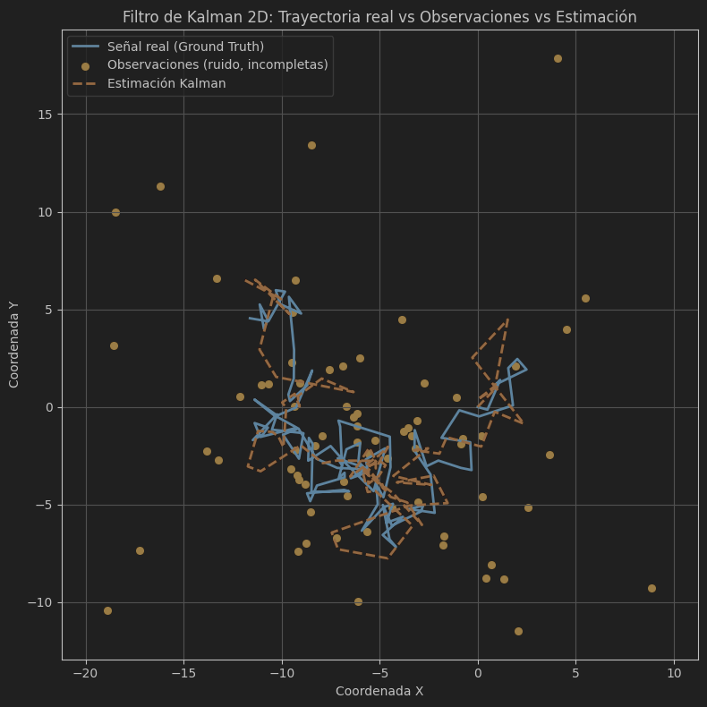

# 🧪 Taller - Filtro de Kalman e Inferencia de Variables Ocultas

## 📅 Fecha
`2025-05-31`

---

## 🎯 Objetivo del Taller

Aprender a implementar el filtro de Kalman para estimar una variable oculta a partir de otras variables observables.
Este taller tiene como objetivo introducir conceptos de inferencia estadística y procesamiento secuencial de señales, aplicables en visión por computador, robótica y predicción de series temporales.

---

## 🧠 Conceptos Aprendidos

- [X] Filtro de Kalman
- [X] Estimación de variables ocultas
- [X] Procesamiento de señales
- [X] Modelos de ruido y observación

---

## 🔧 Herramientas y Entornos

- Python (`numpy`, `matplotlib`)

---

## 📁 Estructura del Proyecto

```
2025-05-31_taller_kalman_inferencia/
├── python/                # Python
├── resultados/            # capturas, métricas, gifs
├── README.md
```

---

## 🧪 Implementación


### 🔹 Etapas realizadas
1. Preparación de datos o escena.
2. Aplicación de modelo o algoritmo.
3. Visualización o interacción.
4. Guardado de resultados.


### 🔹 Código relevante


#### Python

```python
# Filtro de Kalman 1D (modelo random walk)
for k in range(1, n_timesteps):
    # Predecir el paso
    x_pred = x_est[k-1]
    P_pred = P[k-1] + q

    # Paso de actualización (solo si hay observación)
    if not np.isnan(observations[k]):
        K = P_pred / (P_pred + r)  # Ganancia de Kalman
        x_est[k] = x_pred + K * (observations[k] - x_pred)
        P[k] = (1 - K) * P_pred
    else:
        # Sin observación, omitir actualización
        x_est[k] = x_pred
        P[k] = P_pred
```

```python
# Filtro de Kalman 2D (modelo random walk en el plano)
for k in range(1, n_timesteps):
    # Paso de predicción
    x_pred = x_est[k - 1]
    P_pred = P[k - 1] + Q

    # Actualización si la observación no es NaN
    if not np.any(np.isnan(observations[k])):
        K = P_pred @ np.linalg.inv(P_pred + R)  # Ganancia de Kalman
        x_est[k] = x_pred + K @ (observations[k] - x_pred)
        P[k] = (np.eye(2) - K) @ P_pred
    else:
        x_est[k] = x_pred
        P[k] = P_pred
```


---
## 📊 Resultados Visuales

### Python





---

## 🧩 Prompts Usados

### Python
```text
En Python, implementa un filtro de Kalman en 1D o 2D según corresponda. Genera datos sintéticos que simulen una señal real con ruido y observaciones incompletas. Aplica el filtro para estimar la variable oculta a partir de dichas observaciones. Luego, compara gráficamente las tres señales: la real (ground truth), la observada (con ruido) y la estimada por el filtro de Kalman. Visualiza todas ellas en una sola gráfica para apreciar la efectividad del filtro en la reconstrucción de la señal original.
```


---

## 💬 Reflexión Final

- ¿Qué aprendiste o reforzaste con este taller?
Aprendí a implementar el filtro de Kalman y su aplicación en la estimación de variables ocultas a partir de observaciones ruidosas. También reforcé conceptos de inferencia estadística y procesamiento de señales.
- ¿Qué parte fue más compleja o interesante?
La parte más interesante fue entender cómo el filtro de Kalman puede adaptarse a diferentes dimensiones y cómo maneja el ruido en las observaciones. La complejidad radicó en ajustar los parámetros del filtro para obtener una estimación precisa.
- ¿Qué mejorarías o qué aplicarías en futuros proyectos?
Añadiría más ejemplos de aplicación del filtro de Kalman en diferentes contextos. También consideraría explorar variantes del filtro, como el filtro de Kalman extendido para sistemas no lineales.

---

## ✅ Checklist de Entrega

- [X] Carpeta `2025-05-31_taller_kalman_inferencia`
- [X] Código limpio y funcional
- [X] Visualizaciones o métricas exportadas
- [X] README completo y claro
- [X] Commits descriptivos en inglés

---