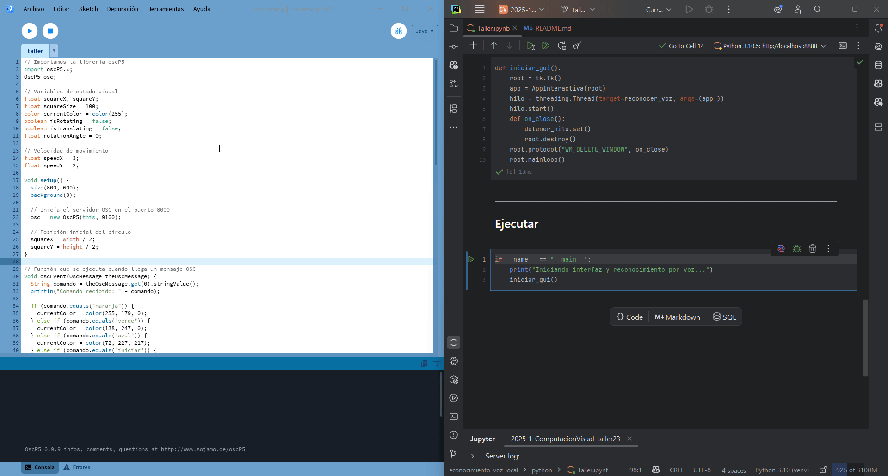

# 🧪 Voz al Código: Comandos por Reconocimiento de Voz Local

## 📅 Fecha
`2025-05-31`

---

## 🎯 Objetivo del Taller

Implementar una interfaz de voz local en Python, sin necesidad de conexión a internet (aunque puede ser opcional), para controlar acciones visuales simples. Este taller busca conectar la entrada de voz con sistemas visuales para crear una experiencia de interacción por comandos hablados.

---

## 🧠 Conceptos Aprendidos

- [X] Comunicación por voz
- [X] Comunicación utilizando OSC (Open Sound Control)
- [X] Transformaciones geométricas (rotación, traslación)


---

## 🔧 Herramientas y Entornos

- Python (`SpeechRecognition`, `pyaudio`, `python-osc`, `tkinter`, `threading`)
- Processing (`OscP5`)


---

## 📁 Estructura del Proyecto

```
2025-05-31_taller_reconocimiento_voz_local/
├── processing/            # Processing
├── python/                # Python
├── resultados/            # Capturas, métricas, gifs
├── README.md
```

---

## 🧪 Implementación


### 🔹 Etapas realizadas
1. **Configuración del Entorno**: Instalación de las librerías necesarias en Python y Processing.
2. **Captura de Audio**: Implementación del reconocimiento de voz en Python utilizando `speech_recognition`.
3. **Comunicación OSC**: Configuración de la comunicación entre Python y Processing mediante mensajes OSC.
4. **Visualización en Processing**: Creación de una escena en Processing que responda a los comandos recibidos.
5. **Interacción Visual**: Implementación de acciones visuales en Processing basadas en los comandos de voz reconocidos.
6. **Pruebas y Ajustes**: Verificación del funcionamiento y ajustes necesarios para una experiencia fluida.


### 🔹 Código relevante


#### Python

```python
COMANDOS = ['naranja', 'verde', 'azul', 'mover', 'girar', 'iniciar', 'detener']
cliente_osc = udp_client.SimpleUDPClient(IP_DESTINO, PUERTO_OSC)
detener_hilo = threading.Event()
```
```python
r = sr.Recognizer()
with sr.Microphone() as source:
    print("Escuchando...")
    r.adjust_for_ambient_noise(source)
    while not detener_hilo.is_set():
        try:
            audio = r.listen(source, timeout=5, phrase_time_limit=3)
            texto = r.recognize_google(audio, language="es-CO").lower()
```
```python
print(f"Comando reconocido: {texto}")
cliente_osc.send_message("/comando", texto)
```


#### Processing

```java
osc = new OscP5(this, 9100);
```
```java
void oscEvent(OscMessage theOscMessage) {
  String comando = theOscMessage.get(0).stringValue();
  println("Comando recibido: " + comando);
  ...
 }
```
```java
void draw() {
  background(0, 20);
  
  setTranslation();
  pushMatrix();            
  translate(squareX, squareY);
  
  setRotation();
  rotate(rotationAngle);

  drawSquare();
  popMatrix(); 
}
```

---
## 📊 Resultados Visuales


### Python + Processing



---

## 🧩 Prompts Usados

### Processing
```text
"Configura una escena en Processing que actúe como visualizador remoto, recibiendo y respondiendo a mensajes OSC enviados desde una aplicación en Python. Utiliza la librería oscP5 en Processing para escuchar los mensajes, . Asocia comandos específicos provenientes del reconocimiento de voz con acciones visuales en la escena, como cambios de color, movimiento o animación, permitiendo un control interactivo y sincronizado entre los sistemas."
```

### Python
```text
"Desarrolla una aplicación en Python que capture audio desde el micrófono utilizando `speech_recognition`, empleando un motor de reconocimiento de voz local. Define un conjunto de comandos básicos (por ejemplo: 'rojo', 'azul', 'girar', 'iniciar', 'detener') y conecta la salida del reconocimiento con una visualización interactiva en Python, como cambio de color o movimiento, usando bibliotecas como `tkinter`. Además, implementa comunicación mediante mensajes OSC a través de `python-osc` para enviar los comandos reconocidos a una escena externa en Processing, permitiendo el control remoto de elementos visuales en tiempo real."
```

---

## 💬 Reflexión Final

- ¿Qué aprendiste o reforzaste con este taller?
Aprendí a integrar el reconocimiento de voz en Python utilizando `speech_recognition` y a comunicarme con Processing mediante OSC, lo que me permitió crear una experiencia interactiva controlada por voz.

- ¿Qué parte fue más compleja o interesante?
La parte más interesante fue la integración de los comandos de voz con las acciones visuales en Processing, ya que me permitió ver cómo la entrada de voz podía influir directamente en la visualización.

- ¿Qué mejorarías o qué aplicarías en futuros proyectos?
Mejoraría la robustez del reconocimiento de voz para manejar mejor los errores y las variaciones en el habla.

---


## ✅ Checklist de Entrega

- [X] Carpeta `2025-05-31_taller_reconocimiento_voz_local`
- [X] Código limpio y funcional
- [X] GIF incluido con nombre descriptivo
- [X] Visualizaciones
- [X] README completo y claro
- [X] Commits descriptivos en inglés

---