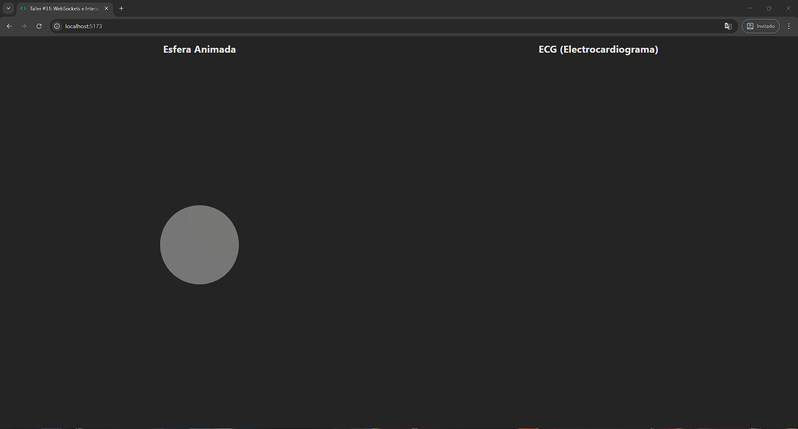

# 🌐 Taller - WebSockets e Interacción Visual en Tiempo Real

## 📅 Fecha
`2025-06-25`

---

## 🎯 Objetivo del Taller

Comprender cómo usar WebSockets para habilitar comunicación en tiempo real entre un cliente (interfaz visual) y un servidor. El objetivo es crear una visualización gráfica que reaccione dinámicamente a datos transmitidos por WebSocket.

---

## 🧠 Conceptos Aprendidos

- [x] WebSockets: protocolo de comunicación bidireccional.
- [x] Comunicación en tiempo real entre cliente y servidor.
- [x] Interacción visual con Three.js y React.
- [x] Envío y recepción de datos en formato JSON.
- [x] Actualización dinámica de objetos 3D en respuesta a datos en tiempo real.
- [x] Uso de `asyncio` y `websockets` en Python para manejar conexiones WebSocket.

---

## 🔧 Herramientas y Entornos


- Python (`websockets`)
- Three.js (`React Three Fiber`)

---

## 📁 Estructura del Proyecto

```
2025-06-25_taller_websockets_interaccion_visual/
├── python/                # Jupyter
├── threejs/               # Three.js
├── resultados/            # Resultados visuales
├── README.md
```

---

## 🧪 Implementación


### 🔹 Etapas realizadas
1. Crear un servidor WebSocket en Python que envíe datos en tiempo real.
2. Configurar un cliente WebSocket en Three.js para recibir y procesar esos datos.
3. Actualizar dinámicamente una escena 3D en Three.js con los datos recibidos.
4. Visualizar la interacción en tiempo real entre el servidor y el cliente.
5. Documentar el proceso y resultados en un README claro.
6. Incluir un GIF que muestre la interacción visual en acción.


### 🔹 Código relevante


#### Python

```python
# Enviar datos en tiempo real con WebSockets
while True:
    data = generate_data()
    await websocket.send(json.dumps(data))
    await asyncio.sleep(0.5)
    
...

# Servidor WebSocket en Python
    async with websockets.serve(send_data, "localhost", 8700):
        await asyncio.Future()
```

#### Three.js

```javascript
// Establece el WebSocket
useEffect(() => {
    const ws = new WebSocket('ws://localhost:8700')

    // Maneja los mensajes entrantes
    ws.onmessage = (event) => {
        const data = JSON.parse(event.data)
        
        // Actualiza la posición y color del objeto
        setPosition({x: data.x, y: data.y})
        setColor(data.color)
    }
```


---
## 📊 Resultados Visuales


### Python + Three.js



---

## 🧩 Prompts Usados


### Python
```text
Utiliza las librerías websockets y asyncio para crear un servidor WebSocket que genere y envíe datos en tiempo real a los clientes conectados. Cada 0.5 segundos, el servidor debe enviar un mensaje en formato JSON con estructura { 'x': ..., 'y': ..., 'color': ... }, donde los valores pueden ser coordenadas aleatorias y un color hexadecimal generado dinámicamente.
```

### Three.js
```text
En una aplicación web construida con React y Three.js (usando React Three Fiber), crea una escena 3D que incluya un objeto básico como una esfera o un cubo. Establece una conexión WebSocket desde el navegador al servidor WebSocket de Python creado previamente y utiliza los datos recibidos en tiempo real (por ejemplo, posición x, y y color) para actualizar dinámicamente la ubicación y el color del objeto en la escena. Asegura una actualización fluida y reactiva del objeto según los mensajes JSON que lleguen desde el servidor.
```


---

## 💬 Reflexión Final

- ¿Qué aprendiste o reforzaste con este taller?

Aprendí a implementar WebSockets para comunicación en tiempo real entre un servidor y un cliente, y cómo integrar esta funcionalidad con Three.js para crear visualizaciones interactivas.

- ¿Qué parte fue más compleja o interesante?

La parte más interesante fue la integración de WebSockets con Three.js, ya que permitió ver cómo los datos en tiempo real pueden influir directamente en la visualización 3D.

- ¿Qué mejorarías o qué aplicarías en futuros proyectos?

Mejoraría la robustez del manejo de errores en la conexión WebSocket y exploraría más sobre optimización de rendimiento para visualizaciones más complejas. 

---


## ✅ Checklist de Entrega

- [x] Carpeta `2025-06-25_taller_websockets_interaccion_visual`
- [x] Código limpio y funcional
- [x] GIF incluido con nombre descriptivo
- [x] README completo y claro
- [x] Commits descriptivos en inglés

---